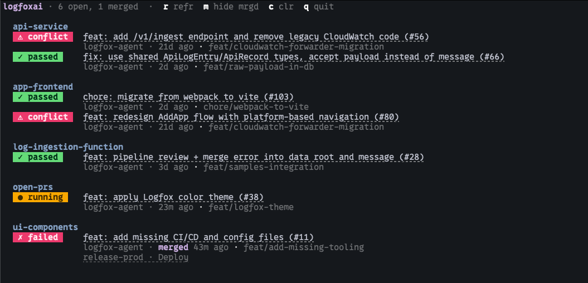

# open-prs

[](https://github.com/logfoxai/open-prs/actions)
[](https://opensource.org/licenses/MIT)
[](https://github.com/logfoxai/homebrew-tap)


**Your entire org's PRs. One terminal.**

`open-prs` is a single-file TUI + CLI tool that shows every open pull request across a GitHub organization — with live CI status, post-merge deploy tracking, clickable links, and a responsive layout that just works. Run it for a full-screen live dashboard, or pass `--once` for a quick terminal printout.

Works great with [AI coding agents](#ai-agent-integration) too — one command gives your agent full cross-repo PR context.

> **Note: Requires `gh auth login` first.**



## Features

- **Instant failure diagnostics** — see exactly which workflow and step failed, right in your terminal, without opening GitHub's slow UI
- **Live CI badges** — passed, failed, running, or no CI for every PR
- **Repo main branch status** — small `✗` or `●` indicator when a repo's default branch is failing or running checks
- **Merge conflict detection** — `⚠ conflict` badge when a PR has conflicts
- **Post-merge deploy tracking** — merged PRs stay visible while deploys run; failures persist, successes fade after 15 min
- **Clickable PR titles** — real hyperlinks in iTerm2, VS Code, Ghostty, Kitty, and more
- **Plain text mode** — `--once --plain` for piping to AI agents or scripts
- **AI-agent friendly** — one command replaces many `gh` calls; saves time and tokens

## Install

macOS or Linux. Requires `gh` authenticated — run `gh auth login` first.

### Homebrew

```bash
brew install logfoxai/tap/open-prs
```

### Upgrade

```bash
brew update && brew upgrade open-prs
```

### Manual (curl)

Requires Python 3.9+ and [GitHub CLI](https://cli.github.com/) (`gh`).

```bash
mkdir -p ~/.local/bin
curl -fsSL -o ~/.local/bin/open-prs https://raw.githubusercontent.com/logfoxai/open-prs/main/open-prs
chmod +x ~/.local/bin/open-prs
```

Add to your shell config so `open-prs` is on your PATH:

```bash
# zsh (default on macOS)
echo 'export PATH="$HOME/.local/bin:$PATH"' >> ~/.zshrc && source ~/.zshrc

# bash
echo 'export PATH="$HOME/.local/bin:$PATH"' >> ~/.bashrc && source ~/.bashrc
```

### Run

```bash
open-prs myorg                 # full-screen live dashboard
open-prs myorg --once          # one-shot print and exit
open-prs myorg --once --plain  # plain text (for piping or AI agents)
```

## Usage

```
open-prs <org> [--once [--plain]]
```

- `<org>` — GitHub organization name (required)
- `--once` — one-shot print and exit (default: full-screen TUI)
- `--plain` — strip colors and links from `--once` output (for piping to scripts or AI agents)

### Keyboard shortcuts

- `r` — Refresh immediately
- `m` — Toggle showing/hiding merged PRs
- `c` — Clear failed deployment cache
- `q` — Quit (also `Ctrl+C`)

## AI Agent Integration

### Use the TUI to manage agentic workflows

When an AI agent is creating, reviewing, or iterating on PRs across many repos, you need to see what's happening without context-switching. Run `open-prs` in a persistent spot and glance at it:

- **Large monitor** — Keep it in the bottom-right corner of a second screen. One command, full org view: what's open, what's failing CI, what just merged, what's deploying.
- **VS Code terminal** — Run it in a dedicated terminal tab. It stays live while you (or your agent) work in other tabs.
- **iTerm / Kitty / Ghostty** — Same idea: a small window or split that stays open.

You get cross-repo context at a glance instead of running `gh pr list` and `gh pr checks` per repo.

### Plain text for agents

Give your agent the same context via the plain text command:

```bash
open-prs <org> --once --plain
```

`--plain` strips ANSI codes so the output is clean text your agent can parse. Add this to your assistant's rules (Cursor rules, Claude system prompt, etc.):

> Before starting work, run `open-prs <org> --once --plain` to see what's in flight.

Ensure `gh` is authenticated (`gh auth login`) on the machine where the agent runs.

## Status Badges

### Repo Main Branch (next to repo name)

When a repository's default branch has workflow activity:

- `✗` (pink) — Main branch workflow is failing
- `●` (amber) — Main branch workflow is running
- (no icon) — Main branch is healthy (clean by design)

### CI (on open PRs)

- `✓ passed` — All checks passed
- `✗ failed` — One or more checks failed
- `● running` — Checks in progress
- `⚠ conflict` — PR has merge conflicts
- `no ci` — No status checks configured

### Merged / Deploy (on merged PRs)

Recently merged PRs appear for 15 minutes with a purple **✓ merged** badge. If post-merge workflows exist, the badge updates to reflect deploy status:

- `✓ merged` — Recently merged (no deploy pipeline)
- `✓ deployed` — All workflows completed successfully
- `✗ failed` — One or more workflows failed
- `● deploying` — Workflows in progress
- `◦ queued` — Workflows are queued/waiting

Merged and successful deploys fade after 15 minutes. Failed deploys persist until resolved.

## How It Works

1. A single GitHub GraphQL call fetches all open + recently merged PRs across the org
2. For each merged PR, a REST call checks workflow run status
3. **Repo main branch status** is fetched asynchronously in parallel (cached for 5 minutes) and displayed as subtle indicators next to repo names
4. Everything renders with 24-bit true color (ANSI), OSC 8 hyperlinks, and responsive column layout
5. The TUI uses the terminal's alternate screen buffer for a clean full-screen experience

## Configuration

All tunables are constants at the top of the script — no config files needed:

- `POLL_SECONDS` — Polling interval in TUI mode (default: `60`)
- `DEPLOY_FADE_SECONDS` — How long successful deploys stay visible (default: `900`)
- `MERGED_LOOKBACK_HOURS` — How far back to search for merged PRs (default: `24`)
- `REPO_STATUS_CACHE_SECONDS` — Cache time for repo main branch status (default: `300`)

## Contributing

- Star this repo if you find it useful!
- [Open an issue](https://github.com/logfoxai/open-prs/issues) for bugs or feature requests
- PRs welcome against `main`

## License

[MIT](LICENSE)

---

<div align="center">

### Built by the team behind [Logfox](https://logfox.ai)

**Sniff out issues.** AI-powered log observability that detects issues before your users do.

[**Try the free beta →**](https://app.logfox.ai)

</div>
