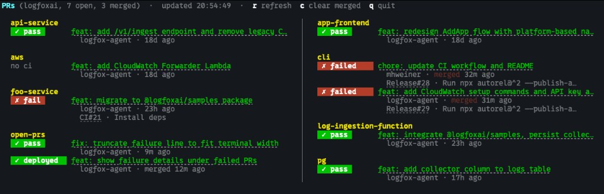

# open-prs

[](https://github.com/logfoxai/open-prs/actions)
[](https://opensource.org/licenses/MIT)


**Your entire org's PRs. One terminal. Zero dependencies.**

`open-prs` is a single-file TUI + CLI tool that shows every open pull request across a GitHub organization — with live CI status, post-merge deploy tracking, clickable links, and a responsive layout that just works. Run it for a full-screen live dashboard, or pass `--once` for a quick terminal printout.

No config files. No Docker. No Node modules. Just one Python script and `gh`. Works great with [AI coding agents](#ai-agent-integration) too — one command gives your agent full cross-repo PR context.

<p align="center">
  
</p>

## Features

- **Live CI badges** — instantly see pass, fail, running, or no CI for every PR
- **Post-merge deploy tracking** — merged PRs stay visible while deploy workflows run; failures stick around, successes fade after 15 min
- **Clickable PR titles** — real hyperlinks (OSC 8) in iTerm2, VS Code terminal, Ghostty, Kitty, and more
- **Responsive 2-column layout** — auto-switches when your PRs overflow the terminal height
- **Full-screen TUI** — alternate buffer, auto-refreshes every 60s, keyboard shortcuts for refresh (`r`), clear merged (`c`), and quit (`q`)
- **Grouped by repo** — clean visual hierarchy, sorted alphabetically
- **Plain text mode** — `--once --plain` strips all ANSI codes for piping to AI agents, scripts, or pipelines
- **AI-agent friendly** — one command replaces 6-8 `gh` calls; compact output saves tokens
- **Single file, zero deps** — runs on any machine with Python 3.9+ and `gh`

## Install

Requires Python 3.9+ and [GitHub CLI](https://cli.github.com/) (`gh`), authenticated.

```bash
# 1. Make sure ~/.local/bin is in your PATH (add to ~/.zshrc or ~/.bashrc)
export PATH="$HOME/.local/bin:$PATH"

# 2. Download
mkdir -p ~/.local/bin
curl -fsSL -o ~/.local/bin/open-prs https://raw.githubusercontent.com/logfoxai/open-prs/main/open-prs
chmod +x ~/.local/bin/open-prs

# 3. Run
open-prs myorg                 # full-screen live dashboard
open-prs myorg --once          # one-shot print and exit
open-prs myorg --once --plain  # plain text (for piping or AI agents)
```

Or clone and symlink:

```bash
git clone https://github.com/logfoxai/open-prs.git
ln -s "$(pwd)/open-prs/open-prs" ~/.local/bin/open-prs
```

## Usage

```
open-prs <org> [--once [--plain]]
```

- `<org>` — GitHub organization name (required)
- `--once` — one-shot print and exit (default: full-screen TUI)
- `--plain` — strip colors and links from `--once` output (for piping to scripts or AI agents)

### Keyboard shortcuts

- `r` — Refresh immediately
- `c` — Clear successfully merged/deployed PRs
- `q` — Quit (also `Ctrl+C`)

## AI Agent Integration

`open-prs --once --plain` was designed for AI coding agents. One command replaces the 6-8 shell calls an agent would otherwise need to get the same cross-repo picture:

| Without open-prs | With open-prs |
|---|---|
| `gh pr list` per repo | Single command, all repos |
| `gh pr checks <n>` per PR | CI status inline |
| Multiple API calls, lots of tokens | One GraphQL call, compact output |
| Manual context switching | Grouped by repo, sorted |

### How to use it

Add this to your AI assistant's rules (Cursor rules, Claude system prompt, etc.):

> Before starting work, run `open-prs <org> --once --plain` to see what's in flight.

Adding `--plain` strips ANSI codes so the output is clean text your agent can parse directly — no escape sequences to wade through. Your agent stays aware of active PRs, CI status, and in-progress deploys across the org, so it doesn't duplicate work or miss context.

## Status Badges

### CI (on open PRs)

- `✓ pass` — All checks passed
- `✗ fail` — One or more checks failed
- `● running` — Checks in progress
- `no ci` — No status checks configured

### Merged / Deploy (on merged PRs)

Recently merged PRs appear for 15 minutes with a purple **✓ merged** badge. If post-merge workflows exist, the badge updates to reflect deploy status:

- `✓ merged` — Recently merged (no deploy pipeline)
- `✓ deployed` — All workflows completed successfully
- `✗ failed` — One or more workflows failed
- `● deploying` — Workflows in progress
- `◦ queued` — Workflows are queued/waiting

Merged and successful deploys fade after 15 minutes. Failed deploys persist until resolved.

## How It Works

1. A single GitHub GraphQL call fetches all open + recently merged PRs across the org
2. For each merged PR, a REST call checks workflow run status
3. Everything renders with ANSI colors, OSC 8 hyperlinks, and responsive column layout
4. The TUI uses the terminal's alternate screen buffer for a clean full-screen experience

## Configuration

All tunables are constants at the top of the script — no config files needed:

- `POLL_SECONDS` — Polling interval in TUI mode (default: `60`)
- `DEPLOY_FADE_SECONDS` — How long successful deploys stay visible (default: `900`)
- `MERGED_LOOKBACK_HOURS` — How far back to search for merged PRs (default: `4`)
- `TWO_COL_MIN_WIDTH` — Minimum terminal width for 2-column layout (default: `100`)

## Contributing

- Star this repo if you find it useful!
- [Open an issue](https://github.com/logfoxai/open-prs/issues) for bugs or feature requests
- PRs welcome against `main`

## License

[MIT](LICENSE)

---

<div align="center">

### Built by the team behind [Logfox](https://logfox.ai)

**Issues, not log soup.** AI-powered log observability that detects issues before your users do.

[**Try the free beta →**](https://app.logfox.ai)

</div>
